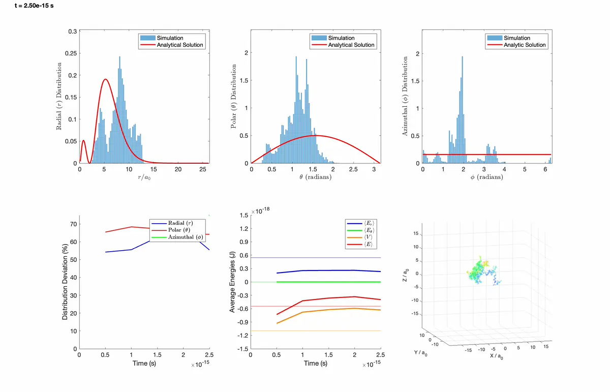
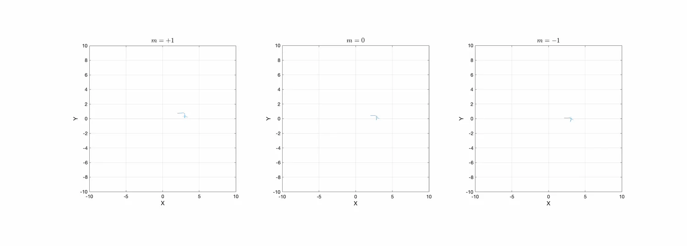

# Description
This repository contains the source code for simulating the hydrogen atom using
Stochastic Mechanics to model the electron’s behavior through Brownian motion.

For more details on the methodology, see the related paper on arXiv:
[Revisiting the Bohr Model of the Atom through Brownian Motion of the Electron](https://arxiv.org/abs/2412.19918).

# Results

## Electron clouds from Brownian motion

Each frame accumulates the electron's Brownian trajectory and colours it by radius
$r/a_0$; a vertical quarter of the cloud is cut away so the interior shell
structure is visible as it fills, while the view slowly rotates. The labels use
the quantum-number notation $(n,l,m)$.

**$(1,0,0)$ state**

<p align="center"></p>

**$(2,0,0)$ state**

<p align="center"></p>

**$(2,1,0)$ state**

<p align="center"></p>

## Brownian motion on sphere with Bohr radius

This is an artificial visualization, not a hydrogen-atom state. It keeps the
electron constrained to a sphere of radius $a_0$ only to build intuition for
Brownian motion before the full hydrogen simulations below.

[](movies/1s0_1fs.webp)

## $(n,l,m)=(1,0,0)$ state
[](movies/1s0_movie.webp)

The electron's initial position is intentionally chosen far from the nucleus, at
spherical coordinates $(10\,a_0,\ \pi/2,\ 0)$, to demonstrate the drift toward
the nucleus.

##  $(n,l,m)=(2,1,0)$ state
[](movies/2p0_movie.webp)

## $(n,l,m)=(2,1,1)$ state
[](movies/2p_m1_movie.webp)

## $(n,l,m)=(2,0,0)$ state
[](movies/2s0_movie.webp)

## Phase-driven azimuthal circulation ($m = \pm 1, 0$)

The $m=+1$ and $m=-1$ states circulate in opposite directions while $m=0$ does
not. Looking straight down the $+z$ axis, the electron (dark dot, fading comet
tail) sweeps counter-clockwise for $m=+1$, clockwise for $m=-1$, and shows no
net sense of rotation for $m=0$:

<a href="movies/2p_pm1_azimuthal_current_3panel.webp"></a>

How to reproduce everything is below: first
[run the simulations](#running-the-simulations), then
[generate the README figures](#generating-the-readme-figures) (the movies above)
and the [manuscript figures](#generating-the-manuscript-figures).

# Machine Specifications

The simulation was run on a **MacBook Pro** (`MacBookPro18,1`), **Apple M1 Pro**
(10 cores: 8 performance + 2 efficiency), **16 GB** RAM, macOS 15.3.1. The run
times quoted in this README are specific to this machine and will vary on other
hardware.

# Running the simulations

Every simulation and figure is produced by a `matlab -batch` one-liner. On macOS
the binary may be at `/Applications/MATLAB_R2024b.app/bin/matlab`, so use your
own path. Each run writes a `data/<run>/` folder (its `.mat` data and, for the
production runs, an `.mp4` dashboard movie).

## Production runs (Figs 1-9, Fig. 11, and the movies)

Single-trajectory runs (`M=1`); the seed is fixed to `7` automatically, so no
`random_seed` is needed.

```bash
matlab -batch 'addpath("functions"); params_set_name="1s0_1fs";   h_atom'   # ~16 min
matlab -batch 'addpath("functions"); params_set_name="1s0_1ps";   h_atom'   # ~30 min
matlab -batch 'addpath("functions"); params_set_name="2p0_10ps";  h_atom'   # ~2.9 h
matlab -batch 'addpath("functions"); params_set_name="2s0_10ps";  h_atom'   # ~2.9 h
matlab -batch 'addpath("functions"); params_set_name="2p_m1_1ps"; h_atom'   # ~27 min
matlab -batch 'addpath("functions"); params_set_name="2p_m0_1ps"; h_atom'   # ~33 min
matlab -batch 'addpath("functions"); params_set_name="2p_mn1_1ps"; h_atom'  # ~37 min
```

## Running angular-momentum estimator (Fig. 10)

For the $L_z/\hbar(t)$ diagnostic, use the compact `*_lz_1ps` presets. These
are not movie runs: they accumulate the estimator online at every integration
step and save only a compact 5000-point time series under `data/<run>/`.

```bash
matlab -batch 'addpath("functions"); params_set_name="2p_m1_lz_1ps"; h_atom'
matlab -batch 'addpath("functions"); params_set_name="2p_m0_lz_1ps"; h_atom'
matlab -batch 'addpath("functions"); params_set_name="2p_mn1_lz_1ps"; h_atom'
```

## Cutoff scan, (2,0,0) state (Fig. 12)

Statistical runs with `M=100` trajectories and `traj_points=1`, fixed total time
`T = 2e-11 s` (20 ps); `n_steps = T/dt` is set automatically. The grid is the
eight cutoffs `v_max/c = 0.01, 0.03, 0.1, 0.3, 1, 2, 3, 5` and the four steps
`dt = 5, 10, 50, 100 zs`, so 32 runs. Each line below carries the exact
`random_seed` used in the published figure.

```bash
# dt = 5 zs  (~28 h each)
matlab -batch 'addpath("functions"); params_set_name="2s0_scan_vmax_0p01c_dt_5zs"; random_seed=7379; h_atom'   # ~28 h
matlab -batch 'addpath("functions"); params_set_name="2s0_scan_vmax_0p03c_dt_5zs"; random_seed=2757; h_atom'   # ~28 h
matlab -batch 'addpath("functions"); params_set_name="2s0_scan_vmax_0p1c_dt_5zs";  random_seed=1115; h_atom'   # ~28 h
matlab -batch 'addpath("functions"); params_set_name="2s0_scan_vmax_0p3c_dt_5zs";  random_seed=1213; h_atom'   # ~28 h
matlab -batch 'addpath("functions"); params_set_name="2s0_scan_vmax_1p0c_dt_5zs";  random_seed=1008; h_atom'   # ~28 h
matlab -batch 'addpath("functions"); params_set_name="2s0_scan_vmax_2p0c_dt_5zs";  random_seed=1005; h_atom'   # ~28 h
matlab -batch 'addpath("functions"); params_set_name="2s0_scan_vmax_3p0c_dt_5zs";  random_seed=1007; h_atom'   # ~28 h
matlab -batch 'addpath("functions"); params_set_name="2s0_scan_vmax_5p0c_dt_5zs";  random_seed=1009; h_atom'   # ~28 h

# dt = 10 zs  (~14 h each)
matlab -batch 'addpath("functions"); params_set_name="2s0_scan_vmax_0p01c_dt_10zs"; random_seed=82379; h_atom'   # ~14 h
matlab -batch 'addpath("functions"); params_set_name="2s0_scan_vmax_0p03c_dt_10zs"; random_seed=41757; h_atom'   # ~14 h
matlab -batch 'addpath("functions"); params_set_name="2s0_scan_vmax_0p1c_dt_10zs";  random_seed=3227;  h_atom'   # ~14 h
matlab -batch 'addpath("functions"); params_set_name="2s0_scan_vmax_0p3c_dt_10zs";  random_seed=3999;  h_atom'   # ~14 h
matlab -batch 'addpath("functions"); params_set_name="2s0_scan_vmax_1p0c_dt_10zs";  random_seed=3001;  h_atom'   # ~14 h
matlab -batch 'addpath("functions"); params_set_name="2s0_scan_vmax_2p0c_dt_10zs";  random_seed=3005;  h_atom'   # ~14 h
matlab -batch 'addpath("functions"); params_set_name="2s0_scan_vmax_3p0c_dt_10zs";  random_seed=3007;  h_atom'   # ~14 h
matlab -batch 'addpath("functions"); params_set_name="2s0_scan_vmax_5p0c_dt_10zs";  random_seed=3009;  h_atom'   # ~14 h

# dt = 50 zs  (~3 h each)
matlab -batch 'addpath("functions"); params_set_name="2s0_scan_vmax_0p01c_dt_50zs"; random_seed=7913; h_atom'   # ~3 h
matlab -batch 'addpath("functions"); params_set_name="2s0_scan_vmax_0p03c_dt_50zs"; random_seed=7815; h_atom'   # ~3 h
matlab -batch 'addpath("functions"); params_set_name="2s0_scan_vmax_0p1c_dt_50zs";  random_seed=7773; h_atom'   # ~3 h
matlab -batch 'addpath("functions"); params_set_name="2s0_scan_vmax_0p3c_dt_50zs";  random_seed=7313; h_atom'   # ~3 h
matlab -batch 'addpath("functions"); params_set_name="2s0_scan_vmax_1p0c_dt_50zs";  random_seed=5213; h_atom'   # ~3 h
matlab -batch 'addpath("functions"); params_set_name="2s0_scan_vmax_2p0c_dt_50zs";  random_seed=5315; h_atom'   # ~3 h
matlab -batch 'addpath("functions"); params_set_name="2s0_scan_vmax_3p0c_dt_50zs";  random_seed=5513; h_atom'   # ~3 h
matlab -batch 'addpath("functions"); params_set_name="2s0_scan_vmax_5p0c_dt_50zs";  random_seed=5713; h_atom'   # ~3 h

# dt = 100 zs  (~1.4 h each)
matlab -batch 'addpath("functions"); params_set_name="2s0_scan_vmax_0p01c_dt_100zs"; random_seed=8113;  h_atom'   # ~1.4 h
matlab -batch 'addpath("functions"); params_set_name="2s0_scan_vmax_0p03c_dt_100zs"; random_seed=8217;  h_atom'   # ~1.4 h
matlab -batch 'addpath("functions"); params_set_name="2s0_scan_vmax_0p1c_dt_100zs";  random_seed=8111;  h_atom'   # ~1.4 h
matlab -batch 'addpath("functions"); params_set_name="2s0_scan_vmax_0p3c_dt_100zs";  random_seed=8819;  h_atom'   # ~1.4 h
matlab -batch 'addpath("functions"); params_set_name="2s0_scan_vmax_1p0c_dt_100zs";  random_seed=98223; h_atom'   # ~1.4 h
matlab -batch 'addpath("functions"); params_set_name="2s0_scan_vmax_2p0c_dt_100zs";  random_seed=98335; h_atom'   # ~1.4 h
matlab -batch 'addpath("functions"); params_set_name="2s0_scan_vmax_3p0c_dt_100zs";  random_seed=99121; h_atom'   # ~1.4 h
matlab -batch 'addpath("functions"); params_set_name="2s0_scan_vmax_5p0c_dt_100zs";  random_seed=99819; h_atom'   # ~1.4 h
```

## Cutoff scan, (2,1,0) state (Fig. 12 companion)

Same grid and parameters with the `2p0_` prefix.

```bash
# dt = 5 zs  (~28 h each)
matlab -batch 'addpath("functions"); params_set_name="2p0_scan_vmax_0p01c_dt_5zs"; random_seed=9359;  h_atom'   # ~28 h
matlab -batch 'addpath("functions"); params_set_name="2p0_scan_vmax_0p03c_dt_5zs"; random_seed=2359;  h_atom'   # ~28 h
matlab -batch 'addpath("functions"); params_set_name="2p0_scan_vmax_0p1c_dt_5zs";  random_seed=67870; h_atom'   # ~28 h
matlab -batch 'addpath("functions"); params_set_name="2p0_scan_vmax_0p3c_dt_5zs";  random_seed=8432;  h_atom'   # ~28 h
matlab -batch 'addpath("functions"); params_set_name="2p0_scan_vmax_1p0c_dt_5zs";  random_seed=34117; h_atom'   # ~28 h
matlab -batch 'addpath("functions"); params_set_name="2p0_scan_vmax_2p0c_dt_5zs";  random_seed=26418; h_atom'   # ~28 h
matlab -batch 'addpath("functions"); params_set_name="2p0_scan_vmax_3p0c_dt_5zs";  random_seed=87576; h_atom'   # ~28 h
matlab -batch 'addpath("functions"); params_set_name="2p0_scan_vmax_5p0c_dt_5zs";  random_seed=23870; h_atom'   # ~28 h

# dt = 10 zs  (~14 h each)
matlab -batch 'addpath("functions"); params_set_name="2p0_scan_vmax_0p01c_dt_10zs"; random_seed=83356; h_atom'   # ~14 h
matlab -batch 'addpath("functions"); params_set_name="2p0_scan_vmax_0p03c_dt_10zs"; random_seed=37576; h_atom'   # ~14 h
matlab -batch 'addpath("functions"); params_set_name="2p0_scan_vmax_0p1c_dt_10zs";  random_seed=31418; h_atom'   # ~14 h
matlab -batch 'addpath("functions"); params_set_name="2p0_scan_vmax_0p3c_dt_10zs";  random_seed=31117; h_atom'   # ~14 h
matlab -batch 'addpath("functions"); params_set_name="2p0_scan_vmax_1p0c_dt_10zs";  random_seed=1118;  h_atom'   # ~14 h
matlab -batch 'addpath("functions"); params_set_name="2p0_scan_vmax_2p0c_dt_10zs";  random_seed=2109;  h_atom'   # ~14 h
matlab -batch 'addpath("functions"); params_set_name="2p0_scan_vmax_3p0c_dt_10zs";  random_seed=2129;  h_atom'   # ~14 h
matlab -batch 'addpath("functions"); params_set_name="2p0_scan_vmax_5p0c_dt_10zs";  random_seed=2669;  h_atom'   # ~14 h

# dt = 50 zs  (~3 h each)
matlab -batch 'addpath("functions"); params_set_name="2p0_scan_vmax_0p01c_dt_50zs"; random_seed=6519; h_atom'   # ~3 h
matlab -batch 'addpath("functions"); params_set_name="2p0_scan_vmax_0p03c_dt_50zs"; random_seed=6577; h_atom'   # ~3 h
matlab -batch 'addpath("functions"); params_set_name="2p0_scan_vmax_0p1c_dt_50zs";  random_seed=6588; h_atom'   # ~3 h
matlab -batch 'addpath("functions"); params_set_name="2p0_scan_vmax_0p3c_dt_50zs";  random_seed=2212; h_atom'   # ~3 h
matlab -batch 'addpath("functions"); params_set_name="2p0_scan_vmax_1p0c_dt_50zs";  random_seed=7718; h_atom'   # ~3 h
matlab -batch 'addpath("functions"); params_set_name="2p0_scan_vmax_2p0c_dt_50zs";  random_seed=7878; h_atom'   # ~3 h
matlab -batch 'addpath("functions"); params_set_name="2p0_scan_vmax_3p0c_dt_50zs";  random_seed=7919; h_atom'   # ~3 h
matlab -batch 'addpath("functions"); params_set_name="2p0_scan_vmax_5p0c_dt_50zs";  random_seed=9879; h_atom'   # ~3 h

# dt = 100 zs  (~1.4 h each)
matlab -batch 'addpath("functions"); params_set_name="2p0_scan_vmax_0p01c_dt_100zs"; random_seed=88576; h_atom'   # ~1.4 h
matlab -batch 'addpath("functions"); params_set_name="2p0_scan_vmax_0p03c_dt_100zs"; random_seed=87576; h_atom'   # ~1.4 h
matlab -batch 'addpath("functions"); params_set_name="2p0_scan_vmax_0p1c_dt_100zs";  random_seed=39576; h_atom'   # ~1.4 h
matlab -batch 'addpath("functions"); params_set_name="2p0_scan_vmax_0p3c_dt_100zs";  random_seed=73870; h_atom'   # ~1.4 h
matlab -batch 'addpath("functions"); params_set_name="2p0_scan_vmax_1p0c_dt_100zs";  random_seed=39879; h_atom'   # ~1.4 h
matlab -batch 'addpath("functions"); params_set_name="2p0_scan_vmax_2p0c_dt_100zs";  random_seed=39870; h_atom'   # ~1.4 h
matlab -batch 'addpath("functions"); params_set_name="2p0_scan_vmax_3p0c_dt_100zs";  random_seed=79879; h_atom'   # ~1.4 h
matlab -batch 'addpath("functions"); params_set_name="2p0_scan_vmax_5p0c_dt_100zs";  random_seed=76879; h_atom'   # ~1.4 h
```

Each run writes to its own folder `data/<set>_seed_<seed>/`. Run points in
parallel by launching one command per MATLAB session.

## Cutoff sweep run time

The total simulated time is fixed at `T = 2e-11 s` (20 ps), so the number of
steps is `n_steps = T/dt` and the run time scales as `1/dt`, almost independent
of `v_max/c`. The measured `dt = 5 zs` runs took about 25.8 to 29.6 h (around
28.5 h on average, about 2.57e-5 s/step at `n_steps = 4e9`). Running 8 runs at a
time (one MATLAB session per core), the eight `v_max/c` points of a given `dt`
finish in about one per-run time:

| dt | n_steps | per run | one batch of 8 (parallel) |
|------|-----------|---------|---------------------------|
| 5 zs   | 4e9 | ~28.5 h | ~28.5 h |
| 10 zs  | 2e9 | ~14.3 h | ~14.3 h |
| 50 zs  | 4e8 | ~2.9 h  | ~2.9 h  |
| 100 zs | 2e8 | ~1.4 h  | ~1.4 h  |

Running the four dt batches one after another, one state (32 runs) takes about
28.5 + 14.3 + 2.9 + 1.4 = about 47 h (~2 days), and both states (64 runs) about
94 h (~3.9 days). The estimates are good to about +/-15%.

# Generating the README figures

These are the movies and image shown in [Results](#results). Run the relevant
[simulations](#running-the-simulations) first.

## 3D trajectory traces

The rotating, radius-coloured cutaway clouds at the top of [Results](#results) are
drawn directly from the trajectory data of the short `*_movie` runs (not from the
dashboard). Run those simulations, then render the clouds with
`make_trajectory_video`. It draws the trajectory, removes a vertical quarter,
colours by radius, labels the colour bar as `r / a_0`, and sweeps the view,
writing a native ~1200 px MP4 to `videos/`:

```bash
matlab -batch 'addpath("functions"); params_set_name="1s0_movie"; h_atom'   # 0.15 ps
matlab -batch 'addpath("functions"); params_set_name="2s0_movie"; h_atom'   # 0.5 ps
matlab -batch 'addpath("functions"); params_set_name="2p0_movie"; h_atom'   # 2 ps
```
```bash
matlab -batch 'make_trajectory_video("1s0")'   # -> videos/1s0_native1200.mp4
matlab -batch 'make_trajectory_video("2s0")'   # -> videos/2s0_native1200.mp4
matlab -batch 'make_trajectory_video("2p0")'   # -> videos/2p0_native1200.mp4
```

The defaults are fixed in `make_trajectory_video`: 1000 frames, 3e6 drawn
trajectory points, vertical quarter cut, final view `(az,el) = (165,12)`, no
title, axis labels `X / a_0`, `Y / a_0`, `Z / a_0`, whole-number time labels
in fs, box `+/-6 a0` for `1s0`, and box `+/-16 a0` for `2s0` and `2p0`.

Convert each MP4 to an animated WebP with [ffmpeg](https://ffmpeg.org)
(`brew install ffmpeg`):

```bash
ffmpeg -y -i videos/1s0_native1200.mp4 -vf "fps=30,scale=1200:-1:flags=lanczos" -c:v libwebp -q:v 75 -compression_level 6 -loop 0 -an movies/1s0.webp
ffmpeg -y -i videos/2s0_native1200.mp4 -vf "fps=30,scale=1200:-1:flags=lanczos" -c:v libwebp -q:v 75 -compression_level 6 -loop 0 -an movies/2s0.webp
ffmpeg -y -i videos/2p0_native1200.mp4 -vf "fps=30,scale=1200:-1:flags=lanczos" -c:v libwebp -q:v 75 -compression_level 6 -loop 0 -an movies/2p0.webp
```

## Dashboard movies

Use `make_dashboard_movie` to regenerate the 6-panel dashboard MP4s from the
stored simulation data, without re-running the simulation. It reads the saved
per-frame histograms, energies, deviations, and trajectory points under
`data/<run>/`, redraws the dashboard, and writes `data/<run>/<run>.mp4`.

For the hydrogen-state dashboard movies, use the short `*_movie` datasets. Those
runs store the full single-electron trajectory over the movie window, so the 3D
trace panel keeps growing for the whole dashboard movie.

| Command name | Stored run (`params_set_name`) | MP4 written | WebP |
|--------------|--------------------------------|-------------|-----|
| `sphere` | `1s0_1fs`   | `data/1s0_1fs/1s0_1fs.mp4`     | `movies/1s0_1fs.webp`  |
| `1s0_movie`    | `1s0_movie`   | `data/1s0_movie/1s0_movie.mp4`     | `movies/1s0_movie.webp`  |
| `2s0_movie`    | `2s0_movie`   | `data/2s0_movie/2s0_movie.mp4`     | `movies/2s0_movie.webp`  |
| `2p0_movie`    | `2p0_movie`   | `data/2p0_movie/2p0_movie.mp4`     | `movies/2p0_movie.webp`  |
| `2p_m1_movie`  | `2p_m1_movie` | `data/2p_m1_movie/2p_m1_movie.mp4` | `movies/2p_m1_movie.webp` |

Rebuild the dashboard MP4s:

```bash
matlab -batch 'make_dashboard_movie("sphere")'      # artificial Brownian sphere, full 1 fs run
matlab -batch 'make_dashboard_movie("1s0_movie")'
matlab -batch 'make_dashboard_movie("2s0_movie")'
matlab -batch 'make_dashboard_movie("2p0_movie")'
matlab -batch 'make_dashboard_movie("2p_m1_movie")'
```

The per-state time window is applied automatically. The dashboard is rendered at
1200 px wide so the six panels stay legible.

Then convert the MP4s to WebP with [ffmpeg](https://ffmpeg.org)
(`brew install ffmpeg`):

```bash
ffmpeg -y -i data/1s0_1fs/1s0_1fs.mp4     -vf "fps=5,scale=1200:-1:flags=lanczos" -c:v libwebp -q:v 75 -compression_level 6 -loop 0 -an movies/1s0_1fs.webp
ffmpeg -y -i data/1s0_movie/1s0_movie.mp4     -vf "fps=5,scale=1200:-1:flags=lanczos" -c:v libwebp -q:v 75 -compression_level 6 -loop 0 -an movies/1s0_movie.webp
ffmpeg -y -i data/2s0_movie/2s0_movie.mp4     -vf "fps=5,scale=1200:-1:flags=lanczos" -c:v libwebp -q:v 75 -compression_level 6 -loop 0 -an movies/2s0_movie.webp
ffmpeg -y -i data/2p0_movie/2p0_movie.mp4     -vf "fps=5,scale=1200:-1:flags=lanczos" -c:v libwebp -q:v 75 -compression_level 6 -loop 0 -an movies/2p0_movie.webp
ffmpeg -y -i data/2p_m1_movie/2p_m1_movie.mp4 -vf "fps=5,scale=1200:-1:flags=lanczos" -c:v libwebp -q:v 75 -compression_level 6 -loop 0 -an movies/2p_m1_movie.webp
```

## Azimuthal-current comet movie

`make_azimuthal_current_movie` reuses the three `2p_m*` runs and writes the
top-down 3-panel MP4 to `videos/2p_pm1_azimuthal_current_3panel.mp4`.
Convert it to WebP with [ffmpeg](https://ffmpeg.org) (`brew install ffmpeg`):

```bash
matlab -batch 'addpath("functions"); make_azimuthal_current_movie'
ffmpeg -y -i videos/2p_pm1_azimuthal_current_3panel.mp4 -vf "fps=50/3,scale=1500:-1:flags=lanczos" -c:v libwebp -q:v 85 -compression_level 6 -loop 0 -an movies/2p_pm1_azimuthal_current_3panel.webp
```

# Generating the manuscript figures

All figures are written to `figures/`. Copy them next to the manuscript `.tex`
before compiling. The table maps each figure to the runs it needs and the driver
that builds it:

| Fig. | Content | Required run(s) | Driver |
|------|---------|-----------------|--------|
| 1 | 1s electron on a sphere | `1s0_1fs` | `make_manuscript_trajectory_figures` |
| 2 | 3D trajectory cutaway clouds | `2s0_movie`, `2p0_movie` | `make_manuscript_trajectory_figures` |
| 3 | Distributions, 1s | `1s0_1ps` | `make_distribution_figures("1s0")` |
| 4 | Distributions, 2p0 | `2p0_10ps` | `make_distribution_figures("2p0")` |
| 5 | Distributions, (2,1,1) | `2p_m1_1ps` | `make_distribution_figures("2p_m1")` |
| 6 | Polar convergence, 2p0 | `2p0_10ps` | `make_convergence_figures("2p0")` |
| 7 | Radial convergence, 2s0 | `2s0_10ps` | `make_convergence_figures("2s0")` |
| 8 | Distribution deviations | `2p0_10ps`, `2s0_10ps` | `make_distribution_deviation_figures("2p0"/"2s0")` |
| 9 | Azimuthal circulation | `2p_m1_1ps`, `2p_m0_1ps`, `2p_mn1_1ps` | `make_azimuthal_current_figure` |
| 10 | Running $L_z/\hbar(t)$ estimator | `2p_m1_lz_1ps`, `2p_m0_lz_1ps`, `2p_mn1_lz_1ps` | `make_lz_running_estimator` |
| 11 | Energies vs time | `2p0_10ps`, `2s0_10ps` | `make_energy_figures("2p0"/"2s0")` |
| 12 | Kinetic-energy cutoff scan | `2s0`/`2p0` cutoff sweep (64 runs) | `analyse_cutoff_scan` |

Once the required runs are present under `data/`:

```bash
# Fig 1 trajectory panels (direct PDF, 600 dpi)
matlab -batch 'make_manuscript_trajectory_figures("sphere", 200e-18)'   # -> figures/1s0_1fs-cloud_partial_200as.pdf
matlab -batch 'make_manuscript_trajectory_figures("sphere", 500e-18)'   # -> figures/1s0_1fs-cloud_partial_500as.pdf

# Fig 2 trajectory cutaway panels (direct PDF, 600 dpi)
matlab -batch 'make_manuscript_trajectory_figures("2s0")'               # -> figures/2s0_0p5ps.pdf
matlab -batch 'make_manuscript_trajectory_figures("2p0")'               # -> figures/2p0_2ps.pdf

# Figs 3-5: distribution panels
matlab -batch 'make_distribution_figures("1s0")'       # Fig 3 -> 1s0_1ps-*_hist_500fs.pdf
matlab -batch 'make_distribution_figures("2p0")'       # Fig 4 -> 2p0_10ps-*_hist_5ps.pdf
matlab -batch 'make_distribution_figures("2p_m1")'     # Fig 5 -> 2p_m1_1ps-*_hist.pdf

# Figs 6-7: convergence panels
matlab -batch 'make_convergence_figures("2p0")'        # Fig 6 -> 2p0_10ps-polar_hist_{100fs,1ps,10ps}.pdf
matlab -batch 'make_convergence_figures("2s0")'        # Fig 7 -> 2s0_10ps-radial_hist_{300fs,340fs,500fs}.pdf

# Fig 8: distribution-deviation panels
matlab -batch 'make_distribution_deviation_figures("2p0")'
matlab -batch 'make_distribution_deviation_figures("2s0")'

# Fig 9 (needs 2p_m1_1ps, 2p_m0_1ps, 2p_mn1_1ps)
matlab -batch 'addpath("functions"); make_azimuthal_current_figure'

# Fig 10: running angular-momentum estimator
matlab -batch 'make_lz_running_estimator'

# Fig 11: energy panels
matlab -batch 'make_energy_figures("2p0")'
matlab -batch 'make_energy_figures("2s0")'

# Fig 12 -- both panels: 2s0 = (2,0,0) left, 2p0 = (2,1,0) right (needs the cutoff sweeps above)
matlab -batch "addpath('functions'); analyse_cutoff_scan('2s0','figures','data','default');" 
matlab -batch "addpath('functions'); analyse_cutoff_scan('2p0','figures','data','default');"
```

`analyse_cutoff_scan` pools every scan run found under `data/` (one curve per
`dt`, fixed y-range `[2, 9]x1e-19` J, analytic value as a dash-dot line) and
writes `figures/<state>_cutoff_scan_kinetic_manuscript.pdf`. Pass `'extended'`
as the 4th argument to get a 6-panel diagnostic figure instead.

```bash
matlab -batch "addpath('functions'); analyse_cutoff_scan('2s0','figures','data','extended')"
```
